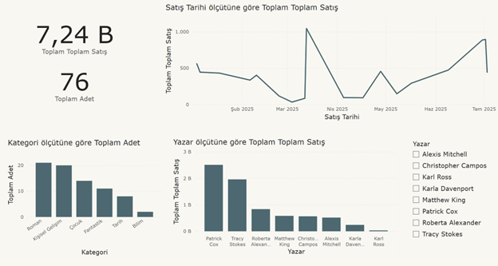

# Book Sale Dashboard 📚📊

Bu projede Power BI kullanarak kitap satış verilerini analiz ettim.

## İçerik
- Satış Adedi ve Toplam Gelir
- Yazar Bazında Ortalama Fiyat
- En Çok Satan Kitaplar
- Kategoriye Göre Filtreleme
- Satış Tarihi Analizi

## Dosya
- `book-sale-dashboard.pbix` – Power BI proje dosyası

## Not
Bu dosya örnek bir dummy veriyle hazırlanmıştır. Veriyi excel dosyasında bulabilirsiniz.

